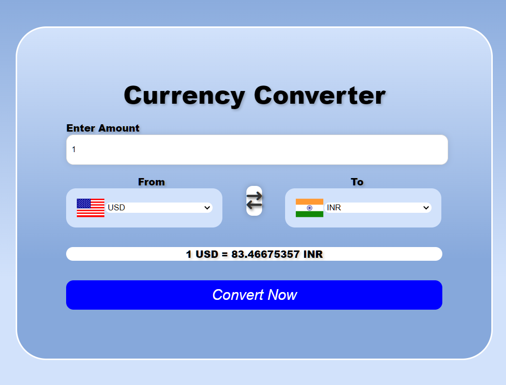
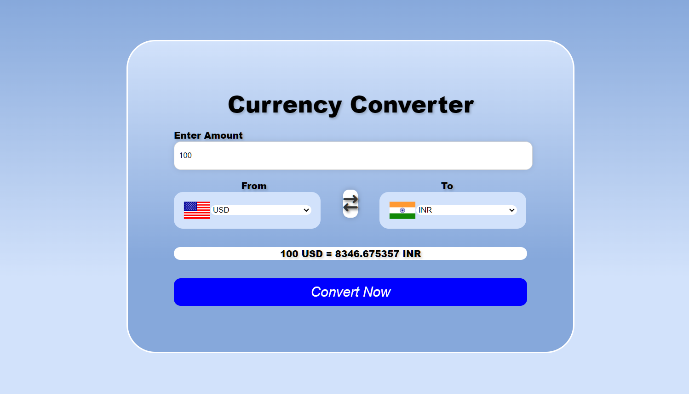
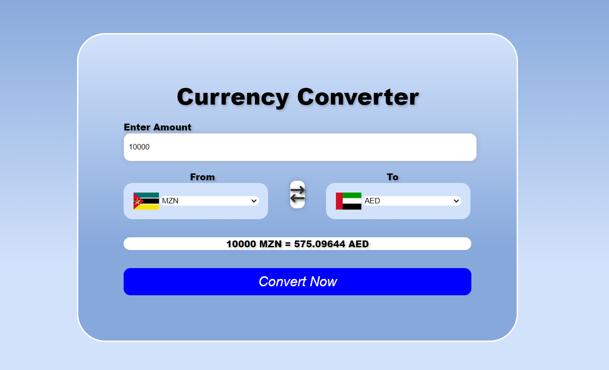

# Currency Converter
This is a Currency Converter Web Application created with the help of HTML, CSS and JavaScript. It enables user to convert different currencies based on real-time exchange value or rates. 
Flags are updated dynamically using [Flags API](https://flagsapi.com/).

## Preview





## Features

- Converts between various currencies using real-time exchange value or rates.
- User Friendly Interface.

## Use This Project on Your Computer/Laptop or Other Devices

1- Clone this repository :-

   ```bash git clone <respository-url>

2- Open index.html in your web browser.
3- Select the currency from the dropdown menu.
4- Enter the amount you want to be convert.
5- Click the convert now button.
6- The converted amount will be dispalyed instantly.

## API Used

Currency API :- It provides to you real-time currency exchange value or rates.

Flags API :- It provides flag images of different countries.

Repository :- https://www.github.com/Sajidahmed8/currency-converter/

Website :- https://www.flagsapi.com/
